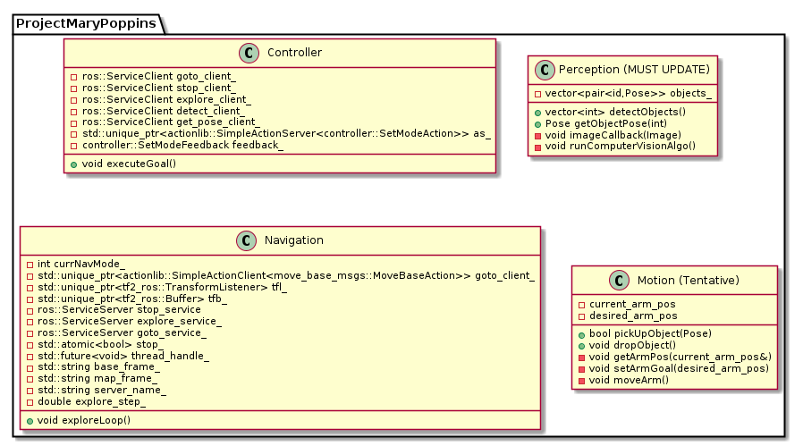
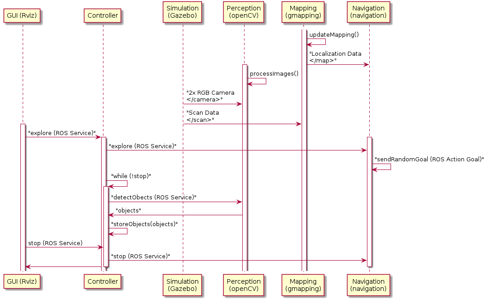
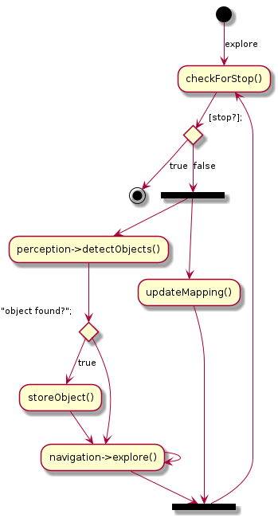

# Cleanup Robot - Project Mary Poppins
[](https://opensource.org/licenses/MIT)
[](https://travis-ci.org/danielmohansahu/cleanup-robot)
[](https://coveralls.io/github/danielmohansahu/cleanup-robot?branch=main)
---

## Overview
The cleanup robot is an autonomous robot, suitable for home use, capable of picking up and placing small objects from the floor into a specific area or receptacle. 
In essence, this robot could be considered a “Roomba for toys” in a playroom and in reference to this idea this
 repo is capable of simulating the operations of an unmanned ground vehicle (UGV) capable of navigating through and detecting objects in
 a simulated household environment, using an off the shelf placeholder for simulation purposes. The simulation (gazebo environment) uses the gmapping package for basic SLAM and navigation during exploration 
and for robust detection of objects it utilizes OpenCV library.

## Dependencies

This project requires Ubuntu 18.04 to run the files. Also, the project has to be built in ROS workspace, so it also requires ROS Melodic.
In addition to these, you may also require Turtlebot3, Gazebo, RViz, gmapping and OpenCV packages. These can be installed by following the below links.

1. [ROS Melodic](http://wiki.ros.org/melodic/Installation/Ubuntu) - follow the steps provided in the link to get ROS Melodic (desktop version).
2. [Gazebo](http://gazebosim.org/tutorials?tut=ros_installing) - Comes with ROS Melodic, may follow steps in the link if gazebo is missing.
3. [RViz](http://wiki.ros.org/rviz) - Comes with ROS Melodic, may follow the link for information on RViz.
4. [Turtlebot3](https://github.com/ROBOTIS-GIT/turtlebot3) - GitHub repo for the Turtlebot3 packages.
5. [OpenCV](https://docs.opencv.org/master/d7/d9f/tutorial_linux_install.html) - Link with instructions to install OpenCV.
6. [gmapping](http://wiki.ros.org/gmapping) - Comes with ROS Melodic, may follow the link for information on gmapping.

## Usage Documentation

### Build Instructions

To build the package on Ubuntu 18.04, run the following from a terminal. This will create a catkin worskpace in your current directory and clone our repository into it.

```bash
sudo apt update && apt upgrade
mkdir catkin_ws/src -p && cd catkin_ws/src
git clone https://github.com/danielmohansahu/cleanup-robot.git --recursive
cd ..
rosdep update && rosdep install --from-paths src/ -iy
catkin_make
```

### Demonstration Instructions

The full demonstration (Gazebo and Rviz required) is launched via the following:

```bash
source devel/setup.bash
roslaunch controller cleanup.launch
```

### Testing Instructions
TODO: After working on testing the files

## Personnel
* Spencer Elyard, a roboticist working on his Masters at UMD.
* Santosh Kesani, a roboticist working on his Masters at UMD.
* Daniel Sahu, a roboticist working on his Masters at UMD.

## Licensing

This project uses the MIT License as described in [the license file](LICENSE).

## Engineering Processes and Documentation

Details on the status of our Agile Iterative Process (AIP) [can be found here](https://docs.google.com/spreadsheets/d/1ZGIvR38WE86Z2n_mLijyDWr1Pk-zrMrPjlQBDKVMC0s/edit?usp=sharing)

Sprint planning notes and reviews [can be found here](https://docs.google.com/document/d/13lss_TF4PRS_DDrdaZ5CRLbK3B5L25zNxDn5uLROZu4/edit?usp=sharing).

Final Presentation [slides](https://docs.google.com/presentation/d/18v54o_jkNd7eZvSBHKtq4ymZj2J1PrO97aqxEOOuSuU/edit?usp=sharing) and [video](https://youtu.be/xhFu7io_70A) are also available.

## Class Diagram

An overview of the classes used and their dependencies is shown in the following UML diagram:



## Sequence Diagram

A sequence diagram for the full program is shown in the following UML diagram:



## Activity Diagram for Explore Behavior

The top level logic for the default "explore" behavior is given in the following diagram. This represents telling the robot to traverse a region and save the locations of all the objects within it.


